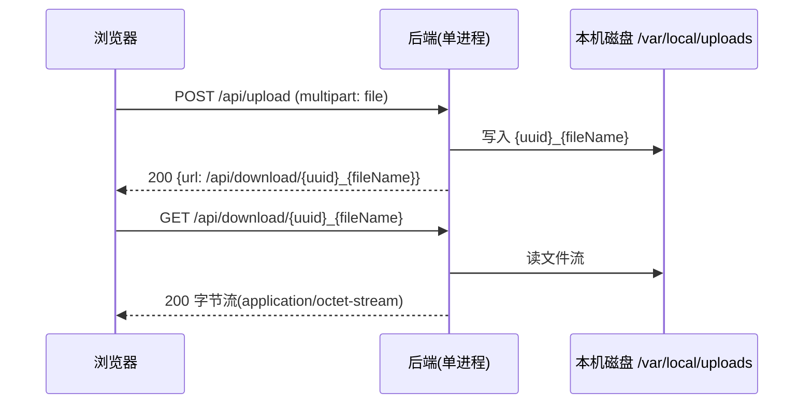
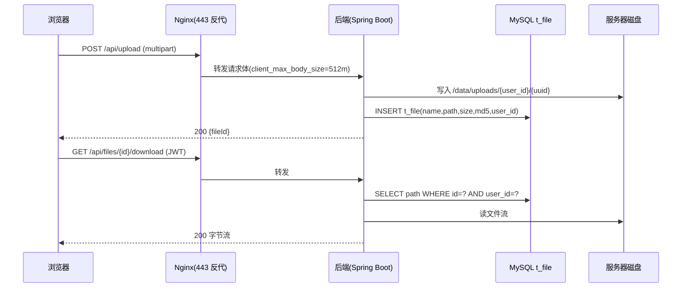
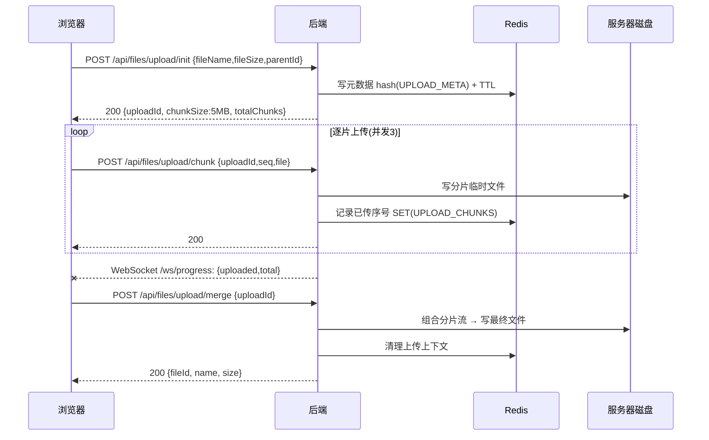
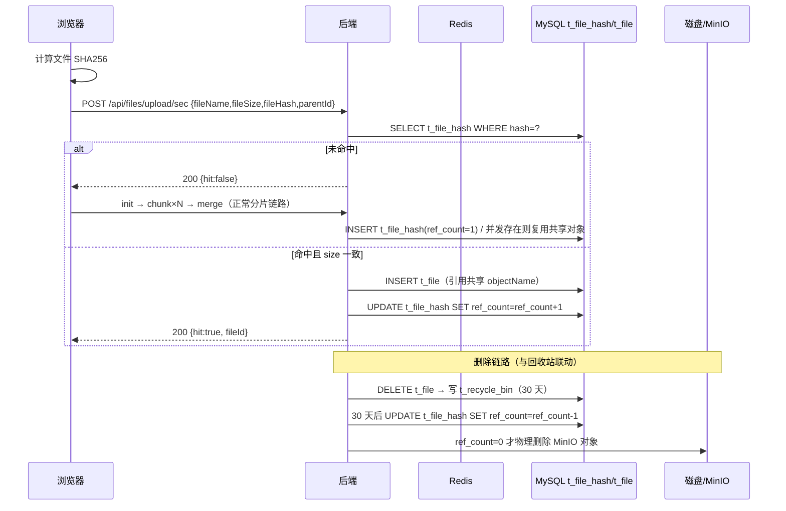
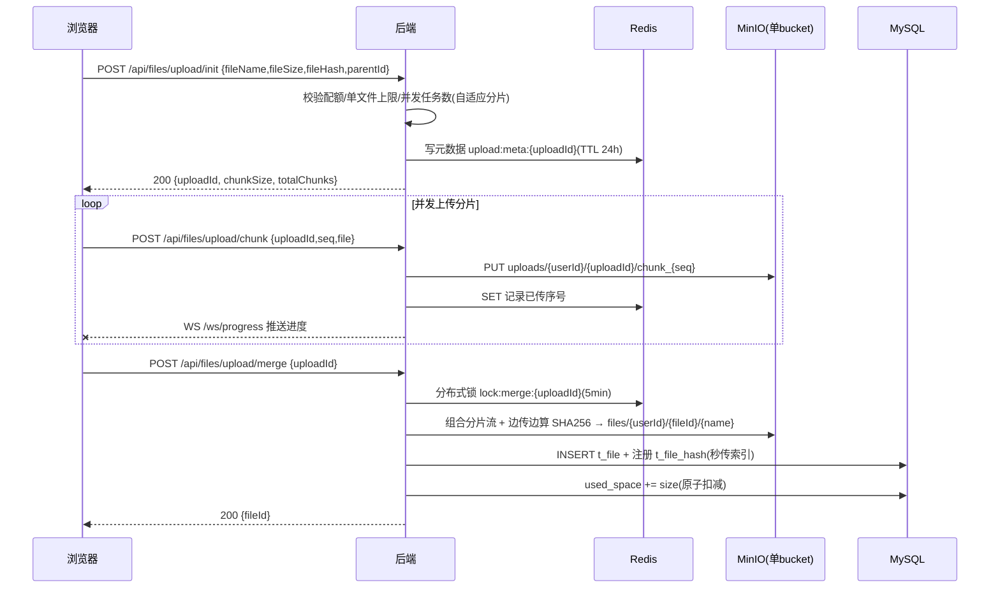
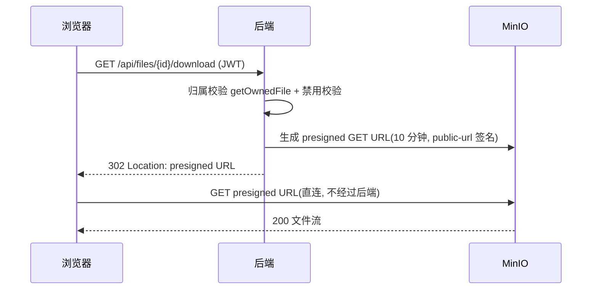
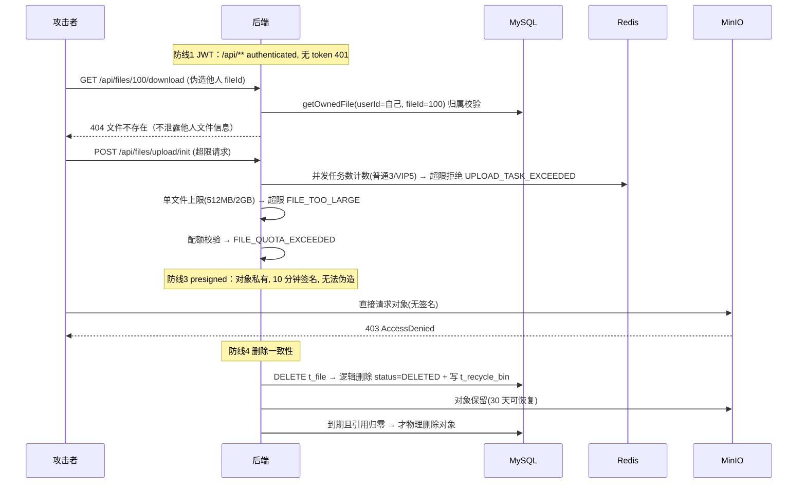

# 文件上传演进：从本机磁盘到对象存储（面试问答与技术手册）

> 声明：阶段 0-2 为**假设重构**（本仓库未真实经历，为说明演进动机而还原的中间形态），阶段 3-5 为本项目**真实采用**（可对照 `docs/adr/001/002/003`、`docs/file-module.md` 与 `backend/` 代码验证）。真实阶段的接口路径、参数名、时序均与代码一致。
>
> 视角说明：本文为第三人称面试问答体（"候选人" / "面试官"），同时满足技术手册的独立阅读要求——每个回答自含上下文、术语精确、有数据与对比表格支撑。

---

## 1. 总览

### 1.1 演进路线图

| 阶段 | 存储 | 上传方式 | 读取方式 | 安全 |
|------|------|----------|----------|------|
| 0 本机磁盘 + 后端转发【假设】 | 本机目录 `/var/local/uploads`，文件名 UUID | 单 `POST multipart` | 后端读文件流返回 | 无鉴权 |
| 1 代理到服务器 + 元数据入库【假设】 | 服务器磁盘 + MySQL `t_file` 表 | 单 `POST multipart`（Nginx 反代） | 后端按 `path` 流式返回 | JWT 接口鉴权 |
| 2 分片上传 + 断点续传【假设】 | 服务器磁盘 + Redis 分片状态 | `init/chunk/merge` 三接口 + WebSocket 进度 | 后端流式返回 | JWT + 分片归属校验 |
| 3 秒传 + 引用计数【真实】 | 服务器磁盘 + `t_file_hash` 全局 SHA256 索引 | 前端算 SHA256 → `/upload/sec` 命中即秒传；未命中走分片 | 后端流式返回 | JWT + 越权防护 + 回收站 30 天联动 |
| 4 对象存储 MinIO + presigned URL【真实】 | MinIO 单 bucket + 前缀分区 | 分片 → MinIO（init/chunk/merge，后端协调） | presigned URL（10 分钟）302 重定向，前端直连 | presigned 时效 + 对象私有 |
| 5 安全加固【真实】 | 同阶段 4 | 分片 + 上传策略（单文件上限/并发数，VIP 差异化） | 同阶段 4 | JWT + 时效 + 防遍历/越权 + 回收站引用联动 + 对象级禁用 |

### 1.2 面试官会怎么问

**三条必问题（每个候选人都会遇到）：**

| # | 必问题 | 本文对应章节 |
|---|--------|--------------|
| 1 | "你项目里文件存在哪？怎么组织的？" | §2（本机磁盘）→ §4（MinIO 前缀分区） |
| 2 | "大文件怎么传？断点续传怎么做？" | §4（分片 init/chunk/merge + Redis 状态） |
| 3 | "重复文件怎么处理？删了还能找回吗？" | §5（秒传 + 引用计数）、§7（回收站联动） |

**三条扩展题预览（用于拉开候选人差距）：**

| # | 扩展题 | 本文对应章节 |
|---|--------|--------------|
| 1 | "下载为什么不占后端带宽？presigned URL 安全吗？" | §6（presigned 302 直连）、§8 安全角度 |
| 2 | "上传 100% 了还能失败吗？合并失败怎么恢复？" | §4 X.4 追问链 2、§8 一致性角度 |
| 3 | "什么规模才引入 MQ / K8s / ES？" | §8 演进角度、§9（三批次对应表） |

---

## 2. 阶段0：本机磁盘 + 后端转发（自娱自乐级）【假设】

> **【假设重构】** 本仓库未真实经历该阶段。此阶段用于建立"最朴素能跑的方案"基线，后续阶段的每个缺陷改进都以此为参照系。

### 2.1 阶段背景与动机

候选人的第一个版本是纯自用单机项目：本机一台电脑，自己上传、自己下载，没有第二个用户。此时工程问题只有两个——"文件放哪"和"怎么让浏览器拿到它"。答案是：

- **存哪**：本机目录 `/var/local/uploads`，文件名直接取 `UUID + 原扩展名`，避免重名覆盖；
- **怎么传**：单 `POST /api/upload`，`multipart/form-data`，后端一次性接收完整文件流并落盘；
- **怎么读**：`GET /api/download/{fileName}`，后端按文件名找盘上文件，以字节流返回。

这一阶段没有任何数据库、没有鉴权、没有分片。它的价值是"能用"，代价是全盘牺牲了可靠性、容量与并发。

### 2.2 实现方案



接口定义（假设阶段接口可自拟，风格为真实接口的前身）：

| 方法 | 路径 | 说明 |
|------|------|------|
| POST | `/api/upload` | 单文件 multipart 上传，返回可访问路径 |
| GET | `/api/download/{fileName}` | 后端读取磁盘文件流返回 |

完整代码（核心部分）：

```java
@RestController
@RequestMapping("/api")
public class NaiveUploadController {

    private static final Path ROOT = Path.of("/var/local/uploads");

    @PostMapping("/upload")
    public Map<String, String> upload(@RequestParam("file") MultipartFile file) throws IOException {
        String storedName = UUID.randomUUID() + "_" + file.getOriginalFilename();
        file.transferTo(ROOT.resolve(storedName));
        return Map.of("url", "/api/download/" + storedName);
    }

    @GetMapping("/download/{name}")
    public void download(@PathVariable String name, HttpServletResponse response) throws IOException {
        Path target = ROOT.resolve(name).normalize();
        if (!target.startsWith(ROOT)) {                     // 防目录穿越
            throw new ResponseStatusException(HttpStatus.BAD_REQUEST);
        }
        response.setContentType("application/octet-stream");
        Files.copy(target, response.getOutputStream());     // 一次性读入响应流
    }
}
```

配置（示意）：

```yaml
upload:
  storage-path: /var/local/uploads   # 本机目录
  max-file-size: 512MB               # Spring 默认 multipart 上限
```

### 2.3 为什么这么做

| 决策点 | 备选 | 选择 | 理由与代价 |
|--------|------|------|------------|
| 文件放哪 | 内存 / 数据库 BLOB / 本机磁盘目录 | 本机磁盘目录 | 最简单；内存重启即失且占 JVM，BLOB 撑爆数据库。代价：单机磁盘、无容量规划 |
| 文件名怎么定 | 原名直存 / UUID+原名 | UUID+原名 | 原名直存会同名互相覆盖；UUID 保证唯一。代价：不可读、无法找回原名（需元数据） |
| 下载怎么返回 | 302 到静态目录 / 后端读流 | 后端读文件流 | 未引入 Web 服务器静态托管，Spring 直接读盘最省事。代价：每个下载都占应用线程与内存 |

**还能不能更差？** 能：文件直接存数据库、或存 `tmpfs`（重启全丢）、或文件名用原名且不做唯一化。这条"更差基线"说明阶段 0 已经是"最简单且可运行"的下限，再往下就不可用了。

### 2.4 面试官追问

**追问链 1：为什么用 UUID 文件名？**
- 面试官问：文件名为什么要加 UUID？直接存原名不行吗？
- 候选人答：直接存原名在同名上传时会互相覆盖——第二次上传会把第一次的文件冲掉，且无法区分两个同名文件。UUID 保证文件系统层唯一。
- 追问：那用户下载时看到的还是 UUID 名，体验很差，怎么解决？
- 候选人答：这就暴露了阶段 0 的根本缺陷——**磁盘上只有文件本身，没有"元数据"**。文件名同时承担了"唯一标识"和"用户展示名"两个职责。解决方向是引入数据库表保存映射（文件名→磁盘路径→用户展示名），即阶段 1 的 `t_file` 表。

**追问链 2：单 POST 传大文件会怎样？**
- 面试官问：一个 2GB 的文件用这个方案传会怎样？
- 候选人答：大概率失败。`multipart` 解析阶段会先把请求体读入内存或临时文件，2GB 直接触发 `max-file-size` 限制（413）或撑爆 JVM 堆；即使传完，`Files.copy` 一次读入响应流也只影响下载侧。
- 追问：传的过程中断网了怎么办？
- 候选人答：整个请求作废，2GB 全部重传——没有断点概念。这就是分片上传（阶段 2）要解决的问题。
- 追问：你怎么知道"什么时候该分片"？
- 候选人答：需要一个阈值决策。真实实现里定的是**小文件阈值 5MB**：小于 5MB 不分片直传，大于 5MB 按分片走（见 §6）。

**追问链 3：重启/断电会丢文件吗？**
- 面试官问：机器重启后文件还在吗？
- 候选人答：文件本身在（磁盘持久化），但没有任何"文件清单"，用户看不到自己传过什么——应用重启前后，访问只能靠记住的 URL 拼文件名。
- 追问：如果这台机器坏了呢？
- 候选人答：全部文件丢失，且**无备份**。这就是"单点"——阶段 1 把磁盘搬到服务器，但单点问题要到阶段 4（MinIO + 备份）才真正缓解。
- 追问（深挖到部署层）：现在这套部署形态，磁盘冗余靠什么？
- 候选人答：真实部署是腾讯云轻量 2C2G 单机 + Docker Compose，5 个容器共用一个数据卷。磁盘冗余目前靠"备份 cron + MinIO 数据卷快照"（MAP 第二批），尚未落地——这是上线后第一风险项。

**追问链 4：下载为什么走后端流？**
- 面试官问：下载为什么不让浏览器直接读静态目录？
- 候选人答：阶段 0 没引入 Nginx，Spring 直接读盘返回是最短路径。但这个决定把**每次下载的全部字节都压在后端进程上**，2C2G 单机同时几路大文件下载，应用线程和内存就被占满。
- 追问：那后来怎么解决的？
- 候选人答：两步。第一步是阶段 1 引入 Nginx 反代（静态与动态分离的思路）；第二步是阶段 4 引入 presigned URL——**下载路径变成"后端签发 → 302 重定向 → 浏览器直连 MinIO"**，后端只处理一个 302，字节流完全不经过应用（§6）。

**追问链 5：这个方案还有没有别的坑？**
- 面试官问：你还能挑出这个方案的几个具体毛病吗？
- 候选人答：至少四个：①没有元数据，无法列出/搜索/重命名；②没有鉴权，任何拿到 URL 的人都能下载（URL 即凭证）；③单 POST 无法断点续传；④磁盘无容量管理，没人知道还剩多少空间。
- 追问：这四个毛病你按什么顺序修？
- 候选人答：优先级取决于崩溃成本。元数据是地基（阶段 1 先做），分片解决"能不能传完"（阶段 2），鉴权解决"能不能被偷"（阶段 1 顺带 + 阶段 5 加固），容量管理（配额）最后交给管理员配置（阶段 5 上传策略）。

### 2.5 如果还要再进一步

| MAP 批次 | 引用内容 | 与本阶段的关联 |
|----------|----------|----------------|
| 第一批 | **备份 cron**（数据层 2.5） | 单机磁盘方案的第一风险就是数据丢失；候选人的回答应落在"备份 + 快照优先于架构演进" |
| 第一批 | **Flyway**（数据层 2.1） | 本阶段无数据库；进入阶段 1 后 schema 管理立刻成为问题，预先说明 Flyway 是第一优先级 |
| 第一批 | **Actuator + Prometheus/Grafana** | 磁盘占用、上传请求量都是本阶段的观测盲区，"docker stats 裸看"不可持续 |

---

## 3. 阶段1：代理到服务器 + 元数据入库 【假设】

> **【假设重构】** 本仓库未真实经历该阶段。动机说明：真实部署前必须回答"丢文件、重启丢失、单点"三个问题。

### 3.1 阶段背景与动机

阶段 0 在"只有一个人用"时可用，一旦部署到服务器（腾讯云轻量 2C2G、Docker Compose + Nginx）就全面崩溃：

1. **丢文件**：Nginx 默认 `client_max_body_size 1m`，大文件被 413 直接拦掉；后端没有元数据，文件在磁盘上就是"孤儿"；
2. **重启丢失**：应用重启后无法重建文件清单；
3. **单点**：文件、应用、数据库全部在同一个 2C2G 实例上，磁盘损坏即全量丢失。

阶段 1 的两个动作：**引入数据库 `t_file` 表保存元数据**（文件与磁盘位置的映射），**引入 Nginx 反代**（TLS 终结、请求体限制、动态与静态分离的雏形）。

### 3.2 实现方案



`t_file` 表结构（假设阶段的最小形态，真实表见 `docs/DATABASE.md §3.1`）：

```sql
CREATE TABLE t_file (
  id        BIGINT PRIMARY KEY AUTO_INCREMENT,
  name      VARCHAR(255) NOT NULL,      -- 用户展示名
  path      VARCHAR(512) NOT NULL,      -- 磁盘路径
  size      BIGINT NOT NULL,            -- 字节
  md5       VARCHAR(32) DEFAULT NULL,   -- 内容摘要
  user_id   BIGINT NOT NULL,            -- 归属用户
  created_at DATETIME NOT NULL,
  updated_at DATETIME NOT NULL
);
```

Nginx 反代配置（真实部署形态为 `docs/DEPLOYMENT.md` 的容器编排）：

```nginx
server {
    listen 443 ssl;
    client_max_body_size 512m;              # 阶段0 被 413 拦掉的根因
    location /api/ {
        proxy_pass http://backend:8080;
        proxy_read_timeout 300s;            # 大文件上传/下载超时
        proxy_request_buffering off;        # 流式转发，避免 Nginx 落盘缓冲
    }
}
```

后端核心逻辑：

```java
@Service
public class FileService {

    public Long save(Long userId, MultipartFile file) throws IOException {
        Path dir = Path.of("/data/uploads/" + userId);      // 按用户分目录
        Files.createDirectories(dir);
        String stored = UUID.randomUUID().toString();
        Path target = dir.resolve(stored);
        file.transferTo(target);
        File record = new File();
        record.setName(file.getOriginalFilename());
        record.setPath(target.toString());
        record.setSize(file.getSize());
        record.setMd5(digest(target));                       // MD5 预留去重
        record.setUserId(userId);
        fileMapper.insert(record);                           // 元数据入库
        return record.getId();
    }

    public Path resolveOwned(Long userId, Long fileId) {
        File record = fileMapper.findByIdAndUserId(fileId, userId);
        if (record == null) {
            throw new BusinessException(ErrorCode.FILE_NOT_FOUND);
        }
        return Path.of(record.getPath());                    // 归属校验：他人文件查不到
    }
}
```

### 3.3 为什么这么做

**为什么需要元数据：**

| 能力 | 无元数据（阶段0） | 有元数据（阶段1） |
|------|-------------------|-------------------|
| 文件列表/搜索 | 无，只能拼 URL | SQL 查询即可 |
| 重命名/移动 | 不可能 | 仅改数据库（真实实现"移动仅改 parentId"，见 file-module.md §8.3） |
| 归属与权限 | 无 | `user_id` 字段 + 查询条件 |
| 去重 | 无 | md5 字段（阶段 3 升级为全站 SHA256 索引） |
| 容量管理 | 无 | size 字段可统计（阶段 5 做配额） |

**为什么需要 Nginx 反代：**

| 决策点 | 备选 | 选择 | 理由与代价 |
|--------|------|------|------------|
| 谁对外暴露 | 直接暴露 Spring Boot 8080 / Nginx 443 | Nginx 443 | 获得 TLS、`client_max_body_size` 控制、请求缓冲；代价是多一层转发（单机可接受） |
| 大文件怎么传 | 调大 Spring 限制即可 | Nginx + Spring 双侧限流 | 单侧放开没意义：Nginx 先拦 413，后端再拦超限。两层都要配置一致（这正是真实部署踩过的坑：配置缺项导致上传失败，见 `docs/bugs/`） |
| 内容摘要用哪种 | MD5 / SHA1 / SHA256 | 本阶段 MD5 | 假设阶段只做"变更检测"，MD5 够快；阶段 3 因**碰撞与防篡改**升级为 SHA256（见 §5 X.3） |

**本机方案在真实部署下的崩溃点：** 阶段 0 的三个缺陷（丢文件、重启丢失、单点）在阶段 1 解决了前两个（元数据可重建清单、Nginx 限制可配置），单点问题依然存在——数据库和文件在同一台机器上，备份缺失时磁盘故障 = 全量丢失。这个问题要到阶段 4（对象存储 + 备份）才正面处理。

### 3.4 面试官追问

**追问链 1：为什么不把文件直接存数据库 BLOB？**
- 面试官问：有了数据库，为什么不把文件内容直接存成 BLOB 列？
- 候选人答：BLOB 方案有三个代价：①数据库体积膨胀后备份、迁移、索引性能全线恶化；②大对象读写占用数据库连接和内存，把"文件 IO"和"业务查询"混在一个池子里；③无法利用文件系统的流式读写。
- 追问：BLOB 有什么场景反而合适？
- 候选人答：小文件（如几百 KB 的配置快照、图片元数据）、强事务需求（文件与业务记录必须同事务提交）的场景。对"云盘"这种以 GB 计的大对象场景不合适。
- 追问（深挖到部署层）：所以文件放磁盘、路径放数据库，那"数据库与文件的一致性"怎么保证？
- 候选人答：先写文件、再写数据库；写入失败删文件回滚；真实上传链路在 merge 阶段有补偿逻辑——失败删除占位记录和临时对象（§6 merge 的兜底补偿）。再往上就是 MAP 里 Flyway 管的 schema 一致性问题。

**追问链 2：md5 有什么用？**
- 面试官问：md5 字段现在没用上，为什么留它？
- 候选人答：为去重做准备——同一文件传两次，磁盘上有两份副本。md5 是"内容是否相同"的廉价判断。
- 追问：为什么后来换成了 SHA256？
- 候选人答：MD5 已被证明存在构造碰撞的能力，恶意场景下可被用于伪造内容；且 MD5 只有 32 位十六进制，去重索引的碰撞概率更高。阶段 3 的真实实现用 SHA256 64 位十六进制 + 全站唯一索引（`uk_hash`），并配合 size 双重校验（§5 X.4 追问链 4）。
- 追问：md5/sha256 在前端算还是后端算？
- 候选人答：真实实现是**前端计算**（`crypto.subtle` 类实现），init 时把 `fileHash` 传给后端，merge 时后端边组合分片边重算校验，两次 hash 一致才落库——防止分片传输过程中内容被篡改或损坏（§6 merge 代码）。

**追问链 3：Nginx 的 client_max_body_size 设多少？**
- 面试官问：512m 这个数怎么定的？设 1GB 行不行？
- 候选人答：可以，但这是"单 POST"时代的妥协——上限越大，单个请求失败的重传成本越高，Nginx 缓冲盘的占用越大。真实解法是分片：把"总大小限制"拆成"单分片大小限制"（10MB），配合 Redis 记录分片状态（§4）。
- 追问：超过限制返回什么？用户体验怎么兜？
- 候选人答：Nginx 返回 413，后端 init 校验返回明确的业务错误码（真实为 `FILE_TOO_LARGE`），前端在**发起上传前**先查上传策略（`GET /api/files/upload/policy`）拿到上限，超限直接拒绝，不发无效请求。

**追问链 4：路径里有 user_id，会泄露吗？**
- 面试官问：磁盘路径 `{user_id}/` 组织，会不会被遍历？
- 候选人答：本阶段路径不对外暴露（下载按 fileId 查库），但**文件系统层的目录结构无法防应用层漏洞**——如果有人拿到别人的 fileId，`findByIdAndUserId` 查不到就返回不存在，这是归属校验的第一道闸。
- 追问：那防遍历的完整手段是什么？
- 候选人答：真实实现（阶段 5）的原则是**越权访问统一按"文件不存在"处理**（FileController 注释明示"不泄露他人文件信息"），配合 JWT 鉴权、presigned URL 时效、对象级禁用三层（§7 详述）。

**追问链 5：数据库和文件都在同一台机器，这个单点你怎么看？**
- 面试官问：2C2G 单机，数据库崩了文件还在，文件盘坏了数据库还在，你怎么取舍？
- 候选人答：先承认现状——单机意味着没有高可用，目标是"可恢复"而不是"不故障"。恢复手段按顺序：①MinIO 数据卷快照 + mysqldump 定时备份（MAP 第二批的备份 cron）；②Docker Compose 一键重建；③数据量未到，不做主从/集群（MAP 第三批"口述层"：2C2G 上 K8s 是表演）。
- 追问：备份多久做一次？恢复目标多少？
- 候选人答：当前是待办项（`docs/ARCHITECTURE-TECHNOLOGY-MAP.md §2.5` 明确"无任何备份，上线后第一风险"）。候选人的诚实口径：**备份 cron 应优先于任何架构演进**，这是 MAP 第二批里文件链路最相关的一条。

### 3.5 如果还要再进一步

| MAP 批次 | 引用内容 | 与本阶段的关联 |
|----------|----------|----------------|
| 第一批 | **Flyway**（数据层 2.1） | 本阶段建表靠手工 SQL，曾因生产库缺 3 列导致后端崩溃重启 93 次（BUG 6）。Flyway 版本化迁移是根除该类事故的第一优先级 |
| 第一批 | **JUnit5 + Mockito + JaCoCo**（5.3） | `FileService` 的保存/查询/归属校验是核心逻辑，pom 已有 `-test` starter 依赖却只有空 contextLoads 测试，是全项目最大短板 |
| 第二批 | **OpenAPI 契约化**（1 节） | 上传/下载接口的契约（multipart 参数、错误码）应通过 springdoc `@Tag/@Operation` 收敛，前端用 openapi-typescript 生成类型 |

---

## 4. 阶段2：分片上传 + 断点续传 【假设】

> **【假设重构】** 本仓库未真实经历该阶段。本阶段的分片接口形态（init/chunk/merge）是真实阶段 4 接口的**直接前身**，路径命名风格一致（均为 `/api/files/upload/*`）。

### 4.1 阶段背景与动机

阶段 1 能传大文件，但有两个硬伤：

1. **单 POST 传大文件失败率高**：一次请求携带全部字节，任一处断网、超时、进程重启，整个请求作废，全量重传；
2. **无进度**：用户不知道传了百分之多少，只能干等。

阶段 2 引入经典三段式分片上传：`init`（登记会话）→ `chunk`（逐片上传）→ `merge`（组合落库），分片状态放 Redis，进度经 WebSocket 推送。

### 4.2 实现方案



接口定义（假设阶段，路径与真实阶段 4 一致）：

| 方法 | 路径 | 说明 |
|------|------|------|
| POST | `/api/files/upload/init` | 校验（配额/大小/并发数雏形）→ 生成 uploadId、分片参数 |
| POST | `/api/files/upload/chunk` | 上传单分片（uploadId + seq + 文件体） |
| POST | `/api/files/upload/merge` | 组合分片 → 落库 → 清理临时数据 |
| GET | `/api/files/upload/progress/{uploadId}` | 查询已传分片（断点续传） |

核心逻辑（假设形态，真实实现见 §6 代码）：

```java
// init：登记上传会话，返回分片参数
public UploadInitResponse init(Long userId, UploadInitRequest request) {
    long chunkSize = request.getFileSize() <= 5MB ? request.getFileSize() : 5MB;
    int totalChunks = (int) Math.ceil((double) request.getFileSize() / chunkSize);
    String uploadId = UUID.randomUUID().toString().replace("-", "");
    redis.opsForHash().putAll("upload:meta:" + uploadId, Map.of(
            "userId", String.valueOf(userId),
            "fileName", request.getFileName(),
            "fileSize", String.valueOf(request.getFileSize()),
            "chunkSize", String.valueOf(chunkSize),
            "chunkCount", String.valueOf(totalChunks)));
    redis.expire("upload:meta:" + uploadId, Duration.ofHours(24));   // 会话 TTL
    return new UploadInitResponse(uploadId, chunkSize, totalChunks);
}

// chunk：幂等——已传且对象存在则跳过（断点续传的核心）
public void uploadChunk(Long userId, String uploadId, int seq, MultipartFile file) {
    String objectName = uploadsDir(userId, uploadId, seq);
    if (redis.opsForSet().isMember("upload:chunks:" + uploadId, String.valueOf(seq))
            && Files.exists(diskPath(objectName))) {
        return;                                                     // 断点续传：跳过
    }
    file.transferTo(diskPath(objectName));
    redis.opsForSet().add("upload:chunks:" + uploadId, String.valueOf(seq));
    progressHandler.broadcast("upload", Map.of("uploadId", uploadId,
            "uploaded", redis.opsForSet().size("upload:chunks:" + uploadId), "total", totalChunks));
}

// merge：完整性校验 → 组合 → 落库 → 清理
public FileNodeResponse merge(Long userId, String uploadId) {
    Map<String, String> meta = readMeta(userId, uploadId);
    if (countChunks(uploadId) != meta.chunkCount) {
        throw new BusinessException(ErrorCode.UPLOAD_CHUNK_MISSING);   // 缺片拒绝
    }
    File record = combineToFinalFile(meta, uploadId);                  // 组合分片流
    cleanup(uploadId);                                                 // 删临时分片 + Redis 上下文
    return FileNodeResponse.from(record);
}
```

### 4.3 为什么这么做

**分片大小与并发度怎么定：**

| 决策点 | 备选 | 选择 | 理由与代价 |
|--------|------|------|------------|
| 分片大小 | 1MB / 5MB / 10MB / 50MB | 5MB | 太小则分片请求数多、HTTP 开销占比大（每片至少一次往返）；太大则单片失败重传成本高。5MB 在 2C2G 单机 + 家用带宽下是重传成本与请求数量的平衡点。**真实实现升级为自适应**：小文件阈值 5MB（以下不分片），大文件分片 10MB（§6） |
| 并发数 | 1 / 3 / 5 / 10 | 3 | 并发 3 足够打满家用上行带宽，同时不挤占 Nginx 与后端线程；真实实现把并发上限做成管理员配置：普通用户 3、VIP 5（`file.max-concurrent-user/vip`） |
| 分片状态存哪 | 内存 / MySQL / Redis | Redis | 内存进程重启即丢；MySQL 每次读写一次网络 IO 且要建表；Redis SET/HASH 天然支持集合运算与 TTL，语义完全匹配"已传序号集合" |

**接口为什么拆成 init/chunk/merge 三段：** 拆段把"一次大请求"变成"多次小请求 + 一次轻量合并"，从而获得三个能力：断点续传（失败只重传缺失片）、并发控制（并发任务数在 init 统计）、进度反馈（chunk 每片完成即广播）。

**WebSocket 为什么比轮询好：** 上传进度是高频事件，轮询 `GET /progress` 在长任务下产生大量无效请求；WebSocket 服务端主动推送，连接复用。真实实现注册了统一进度通道 `/ws/progress`（`WebSocketConfig`），上传与批量打包共用。

**临时分片怎么清理：** 分片会话带 TTL（24 小时）；超时未合并的孤儿分片由定时任务兜底——真实实现每日 04:00 扫描 `uploads/` 前缀，Redis 元数据已不存在的对象即删除（`FileCleanupTask.cleanupStaleUploads`）。**TTL 兜底 + 定时扫描兜底**是双层清理，不能只依赖一层。

### 4.4 面试官追问

**追问链 1：为什么是 5MB，不是 1MB 或 50MB？**
- 面试官问：分片大小怎么定？拍脑袋吗？
- 候选人答：是权衡的结果。分片过小（1MB）：2GB 文件要 2000 次请求，每片都有 HTTP 开销与失败概率，总失败率上升；分片过大（50MB）：单片重传成本高，且大分片请求更容易触发网关超时。5MB 是"单片重传成本"与"请求数量"的平衡点。
- 追问：那这个值要调怎么办？
- 候选人答：不能写死。真实实现把它做成配置（`file.small-file-threshold=5MB`、`file.chunk-size=10MB`），并做成**自适应**——小于阈值不分片直传，大于阈值按配置分片。
- 追问（深挖到部署层）：如果服务器带宽只有 5Mbps，5MB 分片合理吗？
- 候选人答：不合理。分片大小应随网络状况调整——带宽低则单片传输时间变长，更容易撞上网关超时，应调小分片；真实系统还可按 WebSocket 往返时延做动态分片。当前单机场景 2C2G + 家用带宽下 5MB/10MB 够用，动态调整属于"规模到了再说"。

**追问链 2：merge 失败怎么办？（必须从表面问到部署层的深挖链）**
- 面试官问：所有分片都传完了，merge 时失败怎么办？
- 候选人答：分两个层次。①**merge 自身失败**：保留分片与上传上下文，前端可再次调用 merge 重试（真实实现刻意"失败保留分片与元数据供续传"，且 merge 加 Redis 分布式锁防重复合并）；②**合并后校验失败**（hash 不一致）：删除已合并对象与占位记录，要求重新上传。
- 追问：那"临时分片"什么时候被回收？会不会占满磁盘？
- 候选人答：三层保障：①会话 TTL 24 小时；②每日 04:00 定时任务扫描 `uploads/` 前缀，Redis 元数据不存在的孤儿分片全部删除；③merge 成功后立即清理该 uploadId 的上下文。
- 追问（部署层）：对象存储里一直删除会产生什么？怎么管理？
- 候选人答：对象存储层面是"碎片"问题——大量小对象占不满块（MinIO 单文件约 4KB 元数据开销），需要生命周期策略（如按前缀过期）或定期重组。**存储生命周期策略是规模增长后的必答题**，当前数据量下定时清理足够。

**追问链 3：断点续传具体怎么实现？**
- 面试官问：断点续传的"断点"信息存在哪？怎么知道哪些片传过了？
- 候选人答：Redis SET 记录已传分片序号（`UPLOAD_CHUNKS`），前端启动时调 `GET /upload/progress/{uploadId}` 拿到已传列表，只补传缺失片。
- 追问：续传会重复传同一片吗？
- 候选人答：不会，chunk 接口是**幂等**的——"已登记且磁盘/对象存在则跳过"（真实代码 `UploadServiceImpl.uploadChunk` 的判断）。
- 追问：分片是第 3 片传了 5 次，最后一次传坏了，怎么办？
- 候选人答：真实实现合并时做**分片完整性校验**：已传分片数必须等于 `chunkCount`，缺失则报 `UPLOAD_CHUNK_MISSING` 并列出缺失序号；同时 merge 边组合边重算 SHA256，与 init 时前端提交的 hash 比对，不一致则整单作废重传——保证"每个分片都传过"不等于"内容是对的"。

**追问链 4：为什么用 WebSocket 推进度，不用轮询？**
- 面试官问：进度为什么不用轮询？轮询有什么问题？
- 候选人答：轮询是"主动问"，每 1-2 秒一次请求，长任务累计上千次无效请求，且存在延迟；WebSocket 是"被动收"，连接建立后服务端推送，实时性最好。
- 追问：WebSocket 在多实例部署下有问题吗？
- 候选人答：有。连接挂在具体实例上，推送只能发给同一实例的连接。真实场景单实例无此问题；`docs/file-module.md §11` 明确记录**多实例时需 Redis Pub/Sub 广播进度**——这是"规模到了再改"的典型条目。
- 追问：进度从哪来？谁广播的？
- 候选人答：`ProgressWebSocketHandler.broadcast("upload", {uploadId, uploaded, total})`，chunk 落库后由服务端主动推送；批量打包下载复用同一通道（`broadcast("download", ...)`）。

**追问链 5：为什么不直接用现成的 tus/resumable.js 协议？**
- 面试官问：tus 协议是标准分片上传协议，为什么不直接用它？
- 候选人答：tus 解决的是"客户端到服务端的字节传输问题"，但它不管服务端的存储组织、元数据、秒传、配额。引入它会多一层协议适配成本；自家方案用 Redis 记录分片状态，与已有的元数据模型完全打通。
- 追问：什么情况下你会选 tus？
- 候选人答：需要兼容第三方客户端（如移动端 App、桌面工具）时——标准协议换来生态兼容。纯 Web 云盘场景，自家三段式接口更贴合业务。
- 追问：那上传接口设计成"分片"而不是"切片后并行上传直传"，后端会不会是瓶颈？
- 候选人答：这正是阶段 4 要解决的问题——分片写入如果每次都经后端转发到对象存储，后端带宽仍然吃紧。真实架构的分片**经后端协调但落盘在 MinIO**，而下载侧已经完全绕过后端（presigned 302 直连，§6）。

### 4.5 如果还要再进一步

| MAP 批次 | 引用内容 | 与本阶段的关联 |
|----------|----------|----------------|
| 第一批 | **JUnit5 + Mockito + JaCoCo**（5.3） | 分片链路（init 校验、chunk 幂等、merge 完整性、清理补偿）是**测试价值最高的核心逻辑**——应写 Mockito 单测隔离 Redis/MinIO，再上 Testcontainers 跑真实链路 |
| 第一批 | **Actuator + Prometheus/Grafana**（4.1/4.2） | 上传成功率、分片重传率、孤儿分片清理量都应成为指标，2C2G 下各留 64m 内存即可 |
| 第三批（口述层） | **MQ 削峰**（3.2） | 分片状态广播与合并请求在单机下由 Redis 直接承担；若出现"批量压缩下载"高峰（§8 详述），才考虑用 Redis 队列/消息总线削峰，2C2G 跑 Kafka 是表演 |

---

## 5. 阶段3：秒传 + 引用计数 【真实：ADR-003】

> **【真实】** 本阶段为项目真实采用，依据 `docs/adr/003-sec-upload.md`，可对照 `backend/` 的 `UploadServiceImpl.sec/merge`、`FileHashServiceImpl`、`RecycleBinServiceImpl` 验证。

### 5.1 阶段背景与动机

分片上传解决的是"传得完"，但还有一个高频场景没解决：**重复文件**。云盘场景中安装包、视频、文档在用户间大量重复——每个用户都传一遍，带宽与存储都浪费。候选人的真实决策（ADR-003）是：

- 前端计算 SHA256 → `POST /upload/sec`；
- 全站 hash 命中 → 引用计数 +1，**零复制**完成上传；
- 未命中 → 走 init/chunk/merge 正常分片链路；
- 删除走回收站，**30 天到期且引用计数归零才物理删除**对象；
- 团队文件复用同一机制。

### 5.2 实现方案



秒传索引表 `t_file_hash`（见 `docs/DATABASE.md` 与实体 `FileHash`）：

| 字段 | 类型 | 说明 |
|------|------|------|
| id | BIGINT PK | |
| file_hash | VARCHAR(64) | SHA256，唯一索引 `uk_hash`，全站唯一 |
| object_name | VARCHAR(512) | 共享物理对象在 MinIO 的路径 |
| size | BIGINT | 内容大小（秒传时复制给新文件记录） |
| mime_type | VARCHAR(128) | |
| ref_count | INTEGER | 全局引用计数，**归零才删对象** |

核心代码（真实，`FileHashServiceImpl`）：

```java
/** 合并完成时注册索引：命中共享既有对象（引用 +1）；未命中建索引（并发冲突时共享并发方对象） */
public String register(String fileHash, String objectName, long size, String mimeType) {
    FileHash existing = fileHashMapper.findByHash(fileHash);
    if (existing != null) {
        fileHashMapper.incrementRefCount(fileHash);
        return existing.getObjectName();
    }
    FileHash newHash = new FileHash();
    newHash.setFileHash(fileHash);
    newHash.setObjectName(objectName);
    newHash.setSize(size);
    newHash.setMimeType(mimeType);
    newHash.setRefCount(1);
    try {
        fileHashMapper.insert(newHash);
        return objectName;
    } catch (DuplicateKeyException e) {
        // 并发注册：另一请求已建索引 → 共享其对象
        FileHash concurrent = fileHashMapper.findByHash(fileHash);
        fileHashMapper.incrementRefCount(fileHash);
        return concurrent.getObjectName();
    }
}

/** 物理删除时释放引用：归零返回 true，由调用方删对象 */
public boolean releaseRef(String fileHash) {
    int updated = fileHashMapper.decrementRefCount(fileHash);   // 原子 SQL，禁止"先查后改"
    if (updated == 0) {
        return false;
    }
    FileHash after = fileHashMapper.findByHash(fileHash);
    if (after == null || after.getRefCount() <= 0) {
        fileHashMapper.deleteByHash(fileHash);
        return true;
    }
    return false;
}
```

秒传入口（真实，`UploadServiceImpl.sec` 摘录）：

```java
public SecUploadResponse sec(Long userId, UploadSecRequest request) {
    // 前置校验：文件名、父目录归属、内容 hash 未命中对象级禁用
    requireNotBlocked(request.getFileHash(), userId);
    FileHash hash = fileHashMapper.findByHash(request.getFileHash());
    if (hash == null) {
        return SecUploadResponse.miss();                        // 未命中 → 走分片链路
    }
    if (!hash.getSize().equals(request.getFileSize())) {
        throw new BusinessException(ErrorCode.UPLOAD_INVALID, "文件大小与秒传索引不一致");
    }
    // 配额校验（团队上传占团队配额，个人占个人配额）…
    String uniqueName = /* 同名自动加"（2）""（3）"后缀 */;
    File file = buildFileRecord(userId, teamId, uniqueName, request.getFileSize(),
            request.getFileHash(), request.getParentId());
    file.setObjectName(hash.getObjectName());                   // 引用共享物理对象
    fileMapper.insert(file);                                    // 每人一条文件记录
    fileHashService.shareRef(request.getFileHash());            // 引用计数 +1
    userService.changeUsedSpace(userId, request.getFileSize()); // 配额扣减
    return SecUploadResponse.hit(FileNodeResponse.from(file));
}
```

回收站联动（真实，`RecycleBinServiceImpl.releaseObject` 摘录）：

```java
/** 释放物理对象：秒传对象引用归零才删；无哈希对象直接删 */
private void releaseObject(RecycleBin record) {
    String hash = record.getFileHash();
    if (hash != null && !hash.isEmpty()) {
        FileHash fileHash = fileHashMapper.findByHash(hash);
        if (fileHash == null) {
            return;
        }
        boolean zero = fileHashService.releaseRef(hash);
        if (zero && fileHash.getObjectName() != null) {
            storageService.delete(fileHash.getObjectName());    // 引用归零 → 物理删除
        }
        return;
    }
    String objectName = record.getObjectName();
    if (objectName != null && !objectName.isEmpty()) {
        storageService.delete(objectName);
    }
}
```

### 5.3 为什么这么做

**全站 vs 仅本人 vs 无引用计数（ADR-003 决策表）：**

| 维度 | 仅本人秒传 | 全站秒传 | 全站秒传 + 引用计数 |
|------|-----------|---------|-------------------|
| 命中率 | 低（自己传自己的重复） | 高（安装包/视频/文档跨用户重复） | 高 |
| 存储效率 | 每人一份对象 | 一份对象 | 一份对象 |
| 删除逻辑 | 直接删 | 删除影响他人（**不可行**） | 计数归零才物理删 |
| 实现复杂度 | 低 | 中 | 中高（需索引表 + 计数表） |

| 决策点 | 备选 | 选择 | 理由与代价 |
|--------|------|------|------------|
| 去重范围 | 仅本人 / 全站 | 全站 | 云盘场景用户间重复文件常见，全站命中率显著高于仅本人（ADR-003 理由 1） |
| 引用管理 | 无计数直接删 / 引用计数 | 引用计数 | 全站共享后"删除影响他人"不可接受；计数归零才物理删是"一份对象多处引用"的安全前提（ADR-003 理由 2） |
| hash 算法 | MD5 / SHA1 / SHA256 | SHA256 | MD5 可构造碰撞（恶意伪造），SHA1 已被官方弃用；SHA256 碰撞概率在工程上可忽略 |
| 团队文件 | 独立去重 / 复用同一机制 | 复用 | 避免两套逻辑（ADR-003 理由 3）；团队文件走 `team_id` 归属 + 同表 `t_file` |
| 物理删除时机 | 引用归零即删 / 回收站到期 AND 归零 | 回收站到期 AND 归零 | 用户删除先进回收站（30 天可恢复）；只有"到期且引用归零"才真正删对象，双重条件缺一不可 |

**为什么"回收站到期 AND 引用计数=0"必须同时成立：** 只按引用计数归零删除，会绕过回收站的恢复窗口（用户刚删的文件被秒删）；只按回收站到期删除，会误删仍被其他用户引用的共享对象（ADR-003 影响项）。物理删除条件是**交集**。

**为什么哈希由前端计算：** 大文件（GB 级）后端算 hash 要重读一遍完整字节，且上传中途无法判断；前端边读边算（Web 加密 API），上传前即可拿到 hash 发起秒传判断。代价是前端环境不可信（Web 端 hash 可被篡改）——真实实现用 merge 时**后端重算 SHA256 比对**兜底（§6 merge 代码）。

### 5.4 面试官追问

**追问链 1：为什么全站秒传，不是仅本人？**
- 面试官问：全站秒传，别人的文件被你"命中"了，算不算隐私泄露？
- 候选人答：不算。秒传判定只交换 hash——SHA256 是单向的，从 hash 无法反推内容；且**你必须已经拥有该文件内容才能算出同样的 hash**。换句话说：你能命中，说明你手里已经有这个文件了，没有新增泄露。
- 追问：那"尝试各种已知文件 hash 探测库里有啥"呢？
- 候选人答：理论上对公开已知文件可行（彩虹表式探测），但响应只返回 hit/miss，攻击者得到的信息等价于"这个公开文件在库中"——收益极低；对大文件，构造探测成本远高于收益。若要更强，可对 hash 加盐（如 `hash = H(secret + content)`），但会影响跨端一致性，当前不引入。
- 追问（深挖到数据层）：引用计数在并发下怎么保证正确？
- 候选人答：全部用**原子 SQL**（`UPDATE t_file_hash SET ref_count = ref_count + 1` / `- 1`），严禁"先查后改"的读改写——两个请求同时减 1 会丢更新（read-modify-write 竞态）。`FileHashServiceImpl` 的注释明确写了这条纪律。

**追问链 2：为什么是"回收站到期 AND 引用计数=0"才物理删？**
- 面试官问：为什么不在引用归零时立即删对象？
- 候选人答：引用归零只代表"数据库里没有活跃记录了"，不代表"用户允许立即删除"——用户刚把文件删进回收站，30 天恢复期内对象必须还在。立即删会让"恢复"功能失效。
- 追问：为什么也不在回收站到期时直接删？
- 候选人答：因为对象可能是秒传共享的，到期的是"这一个用户的一条记录"，不代表其他引用者都删了。删了共享对象，其他用户的下载立即 404。
- 追问：这个删除链路的一致性怎么保证？事务吗？
- 候选人答：真实实现的 `purgeExpired()` **没有显式事务**——引用计数增减（`decrementRefCount` 原子 SQL）与对象删除（`StorageService.delete`）依赖各自原子性，顺序是"先减引用、归零才删对象"。这是刻意取舍：MinIO 删除无法进 MySQL 事务，靠"归零判定"兜底，幂等处理重复清理。

**追问链 3：秒传命中了，配额怎么算？**
- 面试官问：秒传没有实际传字节，为什么要扣配额？
- 候选人答：配额扣的是**该用户在文件系统里的"占用"**——即使物理上共享一份，用户视角自己拥有这个文件，删除时也要释放自己的那份占用。真实实现：秒传命中同样 `changeUsedSpace(+size)`；删除/30 天物理清理时释放配额。
- 追问：什么时候扣？上传失败会重复扣吗？
- 候选人答：**merge 成功后一次性扣减**，分片阶段不扣（file-module.md §4.3）；扣减用原子 `UPDATE t_user SET used_space = used_space + size`。合并失败走补偿（删占位记录），不会重复扣。
- 追问（深挖到数据层）：团队文件也这样？
- 候选人答：是，团队上传占**团队配额**（`teamService.changeUsedSpace`），个人占个人配额——同一套秒传、两套配额口径（与 ADR-011 团队文件一致）。

**追问链 4：SHA256 冲突了怎么办？**
- 面试官问：hash 冲突概率？冲突了文件不就错了吗？
- 候选人答：SHA256 碰撞概率 2^-128 量级，工程上视为不可能；真实实现还有**双重校验**：命中时比对 `hash.getSize().equals(request.getFileSize())`，size 不一致直接拒绝（真实代码 `UPLOAD_INVALID`"文件大小与秒传索引不一致"）。
- 追问：如果连 size 都一致但内容真的不同（人为构造），会怎样？
- 候选人答：极端构造下会引用到错误对象，但用户拿到的是"别人构造的同 hash 文件"，且 merge 路径会做内容 hash 重算比对。工程上接受该风险，因为构造 SHA256 碰撞的成本远超收益。
- 追问：为什么不用"文件内容比对"做最终确认？
- 候选人答：比对需要读取完整对象字节，秒传的意义（零复制、零带宽）就没了。size + SHA256 双校验是成本与正确性的平衡点。

**追问链 5：秒传会不会被滥用（探知他人文件、刷配额）？**
- 面试官问：攻击者用秒传接口探测或批量建立记录，怎么防？
- 候选人答：三道防线：①**对象级禁用**（`requireNotBlocked`）——管理员禁用过的 hash（违规内容）在 merge 与 sec 共用拦截，`UPLOAD_BLOCKED` 拒绝（真实 `DisabledObjectMapper.countBlocked`）；②**配额校验**——每次 sec 都校验剩余配额与单文件上限；③**上传并发任务数限制**——Redis 计数，超限拒绝（VIP 差异化）。
- 追问：秒传没走 init，并发任务数怎么限制它？
- 候选人答：真实实现秒传与分片共用同一套"进行中任务集合"（Redis `UPLOADING` key）与惰性清理逻辑，init 与 sec 都登记；所以两条路径的滥用面是一致的，不存在"绕过 init 就能无限建文件"的漏洞。

### 5.5 如果还要再进一步

| MAP 批次 | 引用内容 | 与本阶段的关联 |
|----------|----------|----------------|
| 第一批 | **JUnit5 + Mockito + JaCoCo**（5.3） | `FileHashServiceImpl` 的 register/shareRef/releaseRef 是**并发正确性核心**，releaseRef 的"归零才删"边界（=0 返回 false、<0 清理、并发回退）必须单测覆盖 |
| 第二批 | **备份 cron**（2.5） | 秒传共享对象是"多对一"引用，备份粒度更复杂——快照必须包含 t_file_hash 与 MinIO 数据卷的一致性（先快照 MinIO 再 mysqldump 的顺序问题值得专门设计） |
| 第三批（口述层） | **ES 全文搜索**（2.4） | 秒传索引是"按内容去重"；文件名搜索仍走 `LIKE`。文件量到万级前 ES 是过度设计，届时才用分词检索替代 LIKE 扫表 |

---

## 6. 阶段4：对象存储 MinIO + presigned URL 直连 【真实：ADR-001/002】

> **【真实】** 本阶段为项目真实采用，依据 `docs/adr/001-minio-bucket.md`、`docs/adr/002-presigned-url.md`，可对照 `backend/` 的 `StorageService`、`MinioConfig`、`DownloadServiceImpl` 验证。

### 6.1 阶段背景与动机

阶段 3 的存储仍是"服务器磁盘 + 数据库路径字段"。随着文件量增长，出现三个不可回避的问题：

1. **容量与单点**：2C2G 单机磁盘有限，磁盘故障 = 全量丢失，备份只能整机做；
2. **后端带宽**：下载/预览全部经后端流式转发，每次大文件下载都吃满应用进程的线程与带宽——单实例被拖垮；
3. **存储管理**：前缀目录、缩略图、打包产物、临时分片混在同一目录，没有统一的组织与生命周期能力。

候选人的真实决策（ADR-001/002）：**引入 MinIO 对象存储（S3 兼容），单 bucket + 前缀分区；下载/预览走 presigned URL（10 分钟有效期）+ 302 重定向，前端直连 MinIO，不占后端带宽。**

### 6.2 实现方案

**上传链路（分片经后端协调，落盘 MinIO）：**



**下载链路（presigned 302 直连）：**



**MinIO 对象结构（ADR-001，单 bucket + 前缀分区）：**

| 用途 | 路径 |
|------|------|
| 分片临时 | `uploads/{userId}/{uploadId}/chunk_{seq}` |
| 个人文件 | `files/{userId}/{fileId}/{objectName}` |
| 团队文件 | `files/team/{teamId}/{fileId}/{objectName}` |
| 缩略图 | `thumbnails/{userId}/{fileId}.jpg` |
| 打包 | `packages/{taskId}.zip` |

**真实代码 — 存储抽象（`StorageService`）：**

```java
public interface StorageService {
    String upload(String objectName, InputStream inputStream, long size, String contentType);
    InputStream download(String objectName);
    void delete(String objectName);
    /** 生成预签名下载 URL，带过期时间 */
    String generateDownloadUrl(String objectName, int expiryInMinutes);
    void copyObject(String sourceObjectName, String destObjectName);   // 秒传同桶复制
    boolean objectExists(String objectName);
    ObjectInfo getObjectInfo(String objectName);
    java.util.List<String> listObjects(String prefix);                  // 定时清理用
    boolean bucketExists(String bucketName);
    void createBucket(String bucketName);
}
```

**真实代码 — presigned client（`MinioConfig`，签名 host 的关键细节）：**

```java
/**
 * 生成 presigned URL 专用的 client（用 public-url 做 endpoint）。
 * S3 v4 签名把 host 值签进签名（SignedHeaders=host），若用内网 endpoint 签名，
 * 浏览器访问公网地址时签名校验必失败（403）。故 presigned 必须用「浏览器可达」的公网地址签名。
 */
@Bean
public MinioClient presignMinioClient() {
    String endpoint = properties.getPublicUrl();
    if (endpoint == null || endpoint.isBlank()) {
        endpoint = properties.getEndpoint();
    }
    return MinioClient.builder()
            .endpoint(endpoint)
            .credentials(properties.getAccessKey(), properties.getSecretKey())
            .build();
}
```

**真实代码 — 下载 302（`FileController`）：**

```java
@GetMapping("/{id}/download")
@Log(operation = OperationType.DOWNLOAD_FILE, target = TargetType.FILE, targetId = "#id", detail = "'下载文件'")
public void download(@PathVariable Long id, HttpServletResponse response) {
    String url = downloadService.getDownloadUrl(AuthorizationPolicy.getCurrentUserId(), id);
    response.setStatus(HttpServletResponse.SC_FOUND);        // 302
    response.setHeader("Location", url);                     // presigned URL(10 分钟)
}
```

**配置（真实 `application-*.yml`，`FileProperties`/`MinioProperties`）：**

```yaml
minio:
  endpoint: http://minio:9000          # 容器内网地址（业务读写）
  public-url: https://minio.example.com  # 浏览器可达地址（presigned 签名，host 签进 S3 v4 签名）
  bucket: cloud-storage                # 单 bucket
  auto-create-bucket: false            # prod 关闭自动建桶

file:
  small-file-threshold: 5242880        # 5MB 以下不分片，直传
  chunk-size: 10485760                 # 分片大小 10MB
  upload-expire-hours: 24              # 上传会话 TTL
  package-expire-hours: 24             # 打包产物过期
  recycle-days: 30                     # 回收站保留天数
  max-size-user: 536870912             # 普通用户单文件上限 512MB
  max-size-vip: 2147483648             # VIP 单文件上限 2GB
  max-concurrent-user: 3               # 普通用户并发任务数
  max-concurrent-vip: 5                # VIP 并发任务数
```

### 6.3 为什么这么做

**存储选型（"存"轴在阶段 0/1 的延续，本阶段正面收口）：**

| 维度 | 服务器磁盘（阶段1-3） | MinIO（S3 兼容，选择） | 云 OSS | NAS |
|------|---------------------|------------------------|--------|-----|
| 成本 | 最低（复用系统盘） | 单容器，2C2G 可跑 | 按量计费，单机项目不划算 | 硬件成本高，小规模不必要 |
| 运维复杂度 | 低 | 中（多一个容器 + 备份） | 零运维 | 高（网络存储协议、权限） |
| 容量扩展 | 磁盘上限，需手工扩 | 对象存储横向可扩 | 弹性 | 受 NAS 盒限制 |
| 数据安全 | 无版本、无生命周期 | 桶级策略、快照备份 | 厂商冗余 | RAID 为主 |
| 迁移成本 | — | 本仓库从磁盘迁入为一次前缀扫描复制（`listObjects` + `copyObject`） | 从 MinIO 迁 OSS 为 S3 协议直迁 | 高 |
| 单点风险 | 高（整机盘） | 中（需备份快照兜底） | 低（厂商 SLA） | 中 |

| 决策点 | 备选 | 选择 | 理由与代价 |
|--------|------|------|------------|
| 存储引擎 | 磁盘 / MinIO / 云 OSS / NAS | MinIO | 2C2G 单机 + Docker Compose 下，云 OSS 计费与内网带宽不划算、NAS 是过重硬件；MinIO 用 S3 标准协议，**未来换云 OSS 是协议级直迁**（`StorageService` 接口即为此留的接缝） |
| 桶组织 | 多 bucket / 单 bucket+前缀 | 单 bucket+前缀 | 秒传 `copyObject` 是高频操作，**同桶内复制实现最简单**，跨桶复制需 CopySource 授权（ADR-001 理由 1）；多桶优势（桶级生命周期/权限隔离）在本项目无体现——临时分片靠定时任务而非生命周期策略（ADR-001 理由 2） |
| 读取方式 | 后端流式转发 / presigned 302 | presigned 302 | 见下方"读"轴对比表 |
| 对象权限 | 公开读 / 私有+presigned | 私有+presigned | 对象私有不公开读（ADR-002）；缩略图公开读需求在单桶下无法用桶级权限实现，统一走 presigned 或业务接口（ADR-001 影响项） |

**"读"轴对比（阶段 0 后端流式的延续）：**

| 维度 | 后端流式转发（阶段0-3） | presigned URL + 302（选择） | 加 CDN |
|------|------------------------|-----------------------------|--------|
| 后端带宽 | **全部字节压在后端** | 不占，前端直连 MinIO | 不占，且省源站流量 |
| 权限时效 | 每次请求实时校验 | URL 10 分钟过期即失效 | 同 presigned（CDN 需要签名校验） |
| Range/断点 | 需自行实现 | MinIO 原生支持（视频拖拽免费获得） | CDN 支持 |
| 流量成本 | 后端带宽费 | MinIO 出口流量 | 按 CDN 流量计费，单机规模不划算 |
| 访问日志 | 后端可记 | 生成 URL 时记录（日志点前置） | CDN 日志 |

**为什么 presigned 不占后端带宽：** 302 重定向把请求交给了 MinIO——后端只做了"校验归属 → 生成签名 → 返回 Location"，一个 10 分钟有效期的签名 URL 把后续全部字节传输移出了应用进程。2C2G 单机的最大瓶颈（应用线程与带宽）被彻底绕开。代价是：URL 有效期内无法撤销（用"生成时校验 + 短时效"对冲，见 §7）。

**为什么是 10 分钟：** 足以让浏览器完成连接建立与下载发起，又足够短使 URL 泄露的暴露窗口可控（ADR-002 理由 3"URL 时效天然提供访问控制"）；该值做成管理员可配置项（`download-link-ttl-minutes`，默认 10）。

### 6.4 面试官追问

**追问链 1：presigned URL 为什么不做每次请求的实时权限校验？（反方必答题）**
- 面试官问：presigned URL 泄露后 10 分钟内谁都能下载，为什么不做后端实时校验？
- 候选人答：实时校验意味着"每次字节都流经后端"——这正是阶段 4 要消除的带宽瓶颈（ADR-002 决策表：权限控制 - presigned 有时效，后端流式可实时校验；单实例压力 - presigned 极低）。**实时校验与不占后端带宽不可兼得**，必须二选一。
- 追问：那泄露窗口怎么兜？
- 候选人答：三重收敛：①有效期仅 10 分钟且**签发时做完整校验**（归属、状态、禁用），签发后泄露面窗口极小；②URL 是 S3 v4 签名（AK 派生 HMAC），**无法伪造或篡改参数**；③需要审计时在生成 URL 处记日志（ADR-002 影响项"如需审计下载日志，在生成 URL 时记录"）。
- 追问（深挖到部署层）：如果要做防盗链呢？
- 候选人答：MinIO 层可配 Referer 防盗链，或换 CDN 的签名校验（鉴权 URL）。当前单机场景 10 分钟时效 + 私有桶已足够；防盗链属于规模增长后的增强（§8 安全角度再展开）。

**追问链 2：为什么上传不直接 presigned 直传，还要经后端？**
- 面试官问：下载都直连 MinIO 了，上传为什么还走后端中转？
- 候选人答：上传需要**业务协调**：init 要做配额/大小/并发数校验，chunk 要维护 Redis 分片状态与进度，merge 要算 hash、注册秒传索引、扣配额——这些状态与逻辑在后端，直传就把校验绕过了。下载侧没有这些前置状态，所以能直连。
- 追问：什么时候上传也可以直传？
- 候选人答：用 MinIO multipart 上传的 presigned 直传（init 生成各分片的 presigned PUT URL，浏览器直接传 MinIO，后端只做 merge 协调）——能省后端上传带宽。代价是校验点后移、进度状态需前端上报，复杂度显著上升。**当前 2C2G 场景上传流量远小于下载流量，未引入**，是清晰的"规模到了再说"。
- 追问：那 chunk 的字节流经后端一次，后端带宽不还是瓶颈？
- 候选人答：上传带宽确实经后端（一次），但：①上传频率远低于下载；②分片并发受限（普通 3 / VIP 5）控制峰值；③下载侧（高频大流量）已经完全直连。整体看带宽大头（读）被移除，写路径保持简单。

**追问链 3：为什么单 bucket 而不是多 bucket？**
- 面试官问：多 bucket 天然隔离，为什么用单 bucket + 前缀？
- 候选人答：核心原因是**秒传 copyObject 同桶复制**——同桶内复制实现最简单，跨桶复制需要 CopySource 授权，每个复制操作都要处理跨桶权限（ADR-001 决策表）。而多 bucket 的两个优势（桶级生命周期、桶级权限隔离）在本项目都用不上：临时分片清理走定时任务而非生命周期策略，缩略图公开读在单桶下靠 presigned 等价实现。
- 追问：什么场景你会拆多桶？
- 候选人答：三类信号：①存储类型分化——缩略图/临时分片/正式文件需要不同的保留策略与成本档位（临时桶可自动过期）；②权限分化——某类对象需要公开读；③容量与备份要分桶治理。届时迁移路径是"新建桶 + 前缀扫描复制 + 配置切换"。
- 追问（深挖到部署层）：前缀分区怎么影响备份策略？
- 候选人答：单桶 = 一个快照覆盖全部（分片/正式/缩略图/打包）——备份简单；多桶则需要多桶分别快照与对齐时间点。这也是当前不拆桶的一个运维理由。

**追问链 4：从磁盘迁到 MinIO，存量数据怎么办？**
- 面试官问：阶段 1-3 的磁盘文件怎么迁到 MinIO？
- 候选人答：对象存储抽象（`StorageService`）让迁移成为"遍历旧存储 + 写入新存储"的搬运任务：`listObjects(prefix)` 枚举旧对象 → `upload()` 写入 MinIO 同路径 → 数据库 `object_name` 已与路径解耦（路径含 fileId，搬运后无需改库）。
- 追问：迁移中断/失败怎么办？
- 候选人答：设计为**幂等搬运 + 双写窗口**：迁移期新上传直接落 MinIO，旧文件按需懒迁移（下载时发现不在 MinIO 则实时搬运并重定向），或批量脚本重试。切换点放在 `StorageService` 实现上——这也是**为什么存接口必须抽象**：底层换实现不动业务层。
- 追问：为什么路径里要含 fileId？
- 候选人答：`files/{userId}/{fileId}/{objectName}`——fileId 是数据库主键，对象路径随之固定；**移动/重命名只改数据库，MinIO 对象完全不动**（file-module.md §8.3）。这是"数据库为路径事实源、存储为内容事实源"的分离设计。

**追问链 5：presigned 签名里 host 是内网地址会怎样？（真实踩坑）**
- 面试官问：签名用内网地址，浏览器访问公网地址，会发生什么？
- 候选人答：403。S3 v4 签名把 `host` 作为 SignedHeaders 参与签名计算，内网 `http://minio:9000` 与浏览器访问的公网地址不一致，服务端验签必失败。真实实现因此拆出**两个 client**：`minioClient`（内网 endpoint，业务读写）与 `presignMinioClient`（public-url endpoint，专门生成签名）——这正是 `MinioConfig` 注释记录的设计原因。
- 追问：这个坑实战中怎么发现的？
- 候选人答：`docs/ARCHITECTURE-TECHNOLOGY-MAP.md` 记录过 `MINIO_ENDPOINT` 用错导致的故障（BUG 6）——**配置漂移**类问题的典型：dev/prod 环境配置不一致。这也是 MAP 把"配置校验 + 启动自检（缺关键配置 fail-fast）"列为轻量替代方案的原因。
- 追问：2C2G 下 MinIO 容器占多少资源？
- 候选人答：MinIO 单容器约 100-200MB 内存，2C2G 总 5 容器（MySQL/Redis/MinIO/后端/Nginx + 前端）可承受；监控建议（Actuator + Prometheus，第一批）里指标要包含对象存储容量。

### 6.5 如果还要再进一步

| MAP 批次 | 引用内容 | 与本阶段的关联 |
|----------|----------|----------------|
| 第二批 | **备份 cron**（2.5，文件链路强相关条目之一） | MinIO 数据卷快照 + mysqldump 定时备份，多副本保留——**当前无任何备份，是上线后第一风险**；引入阈值：立即，优先于一切架构演进 |
| 第二批 | **OpenAPI 契约化**（1 节） | 上传/下载接口（302 语义、错误码、presigned 行为）必须契约化，前端 openapi-typescript 生成类型，杜绝接口漂移 |
| 第三批（口述层） | **CDN**（读轴延伸） | 文件访问量达到"源站带宽成为成本瓶颈"时引入 CDN（鉴权 URL + Referer 防盗链）；单机家用规模不引入，先讲清阈值与代价 |
| 第三批（口述层） | **K8s**（8.3） | MinIO 多实例 + 多副本是 K8s 才顺手的运维形态；2C2G 千万别上，简历口述"Compose → 单节点 K8s → 生产 K8s"演进路线即可 |

---

## 7. 阶段5：安全加固（权限校验 / 防盗链 / 回收站引用联动）【真实】

> **【真实】** 本阶段为项目真实采用，可对照 `backend/` 的 `SecurityConfig`、`AuthorizationPolicy`、`FileController`、`UploadServiceImpl.policy/init`、`RecycleBinServiceImpl` 验证。

### 7.1 阶段背景与动机

阶段 4 解决了"存与读"，但面向真实用户后，安全成为硬约束。真实实现收敛为五道防线：

1. **JWT 鉴权**：`/api/**` 全部要求认证，无状态令牌；
2. **接口权限校验**：所有文件操作从安全上下文取 `userId`，**归属校验不通过一律按"文件不存在"处理**（防遍历/越权）；
3. **presigned URL 时效**：10 分钟过期即失效，替代实时校验；
4. **回收站逻辑删除 + 引用计数物理删除联动**：删除一致性；
5. **上传策略**：init 时校验配额、单文件大小上限、并发任务数（管理员配置，VIP 差异化），违规内容 hash 禁用。

### 7.2 实现方案



**真实代码 — 归属校验（`FileService.getOwnedFile` 语义，Controller 注释原文）：**

```java
// FileController 设计思路原文：
// 1. 所有操作基于当前登录用户，用户 ID 通过 AuthorizationPolicy 从安全上下文获取
// 2. 越权访问统一按文件不存在处理，不泄露他人文件信息
// 3. 下载返回 302 重定向到预签名 URL，文件流不经应用服务器中转
```

**真实代码 — 上传策略（`UploadServiceImpl.policy` + `init` 校验链）：**

```java
/** 上传策略：按 VIP 身份返回对应管理员配置（前端先查后传） */
public UploadPolicyResponse policy(Long userId) {
    boolean vip = isVip(userId);
    UploadPolicyResponse response = new UploadPolicyResponse();
    response.setMaxSize(vip ? adminSettingsService.getMaxSizeVip() : adminSettingsService.getMaxSizeUser());
    response.setMaxConcurrent(vip ? adminSettingsService.getMaxConcurrentVip() : adminSettingsService.getMaxConcurrentUser());
    return response;
}

// init() 校验顺序（真实代码）：
// 1. 配额校验：团队上传占团队配额，个人占个人配额 → FILE_QUOTA_EXCEEDED
// 2. 单文件大小上限（管理员配置，VIP 差异化）→ FILE_TOO_LARGE
// 3. 上传并发任务数（管理员配置，VIP 差异化）→ UPLOAD_TASK_EXCEEDED（Redis 计数 + 惰性清理）
```

**真实代码 — 回收站与引用联动（`FileCleanupTask` 定时任务）：**

```java
@Scheduled(cron = "0 0 3 * * ?")   // 每日 03:00
public void cleanupExpiredData() {
    recycleBinService.purgeExpired();           // 回收站到期(30天)物理清理
    downloadService.cleanupExpiredPackages();   // 打包产物清理(24小时)
}

@Scheduled(cron = "0 0 4 * * ?")   // 每日 04:00
public void cleanupStaleUploads() {
    // 扫描 uploads/ 前缀，Redis 元数据已不存在的孤儿分片 → 删除
}
```

### 7.3 为什么这么做

**五道防线对应的威胁模型：**

| 防线 | 威胁 | 防护机制 | 备选方案 | 为什么不用备选 |
|------|------|----------|----------|----------------|
| JWT 鉴权 | 未认证访问 | `AuthorizationPolicy.getCurrentUserId()` + Security 拦截 | Session | JWT 无状态，多实例天然支持；登出靠黑名单（Redis）补偿 |
| 接口权限校验 | 越权/遍历他人文件 | 归属校验 + 越权按"不存在"处理 | 返回 403 明确拒绝 | 403 暴露"该 ID 存在"，404 语义不泄露任何信息 |
| presigned 时效 | 链接泄露/盗链 | 10 分钟签名、对象私有 | 每次实时校验 | 实时校验 = 字节流经后端，破坏直连设计（§6 追问链 1） |
| 回收站 + 引用计数 | 误删/删除影响他人 | 逻辑删除 + 30 天 + 归零才物理删 | 直接物理删除 | 无恢复窗口；共享对象被误删（§5） |
| 上传策略 | 滥用资源/违规内容 | init 校验 + 对象级禁用 | 不限 | 单机资源有限，必须限额；违规内容 hash 全站拦截 |

**为什么越权返回"文件不存在"而非"无权限"：** 真实注释明示"不泄露他人文件信息"——若返回"无权限"，攻击者可通过枚举 fileId 判断文件是否存在（存在性泄露）；统一 404 使探测成本上升且信息量为零。这是安全与可用性的取舍：牺牲精确错误码，换取零存在性泄露。

**为什么 presigned 过期即失效而不是实时校验：** 见 §6 决策表——实时校验的代价是后端带宽与单实例压力，presigned 的代价是无法撤销；用"10 分钟短时效 + 签发时完整校验 + 签名不可伪造"对冲撤销问题。**该权衡在面试中是"反方问题"的标准答法**（§8 再展开）。

**删除一致性的完整时序：** 用户删除 → `t_file.status=DELETED` 逻辑删除 + 写 `t_recycle_bin`（含 objectName、fileHash、expireTime=30 天后）→ MinIO 对象保留 → 30 天后定时任务扫描 → **引用计数归零才物理删对象** → 删除记录 → 释放配额（`used_space -= size`）。恢复：状态恢复 + 删回收站记录 + 重新占用配额（`docs/file-module.md §7`）。

### 7.4 面试官追问

**追问链 1：JWT 泄露了怎么办？**
- 面试官问：JWT 是无状态的，泄露后怎么撤销？
- 候选人答：真实实现用 Redis 黑名单（`JwtBlacklistService`）——登出/封禁时把 token 加入黑名单直到自然过期；黑名单 TTL 兜底取 access token 有效期。
- 追问：为什么不用 refresh token 体系？
- 候选人答：当前单服务 + 2C2G，access token 有效期（默认 24 小时）足够；refresh token 的收益（缩短泄露窗口）可用"黑名单 + 过期"等价覆盖。OAuth2/刷新令牌属于 MAP 第三批口述层——引入阈值是"需要第三方登录或拆服务"。
- 追问（深挖到部署层）：对称密钥 HS256 签名，密钥存哪？
- 候选人答：真实实现是 HS256 对称密钥（yml + 环境变量注入），**单服务够用**；拆服务时才换 RSA/JWK（非对称 + JWKS，多服务各自验签不共享密钥）——MAP §7.2 明确"知道 HS vs RS 取舍这一句话在面试就够"。

**追问链 2：presigned URL 被盗链/转发了怎么办？**
- 面试官问：有人把下载链接发到群里，10 分钟内大家都能下，算不算漏洞？
- 候选人答：算"已接受的代价"，不算漏洞：①链接只在下载动作后 1 次生成，10 分钟窗口内转发，收益面极小；②对象私有，无签名任何访问 403；③若需更强控制，MinIO 层可加 Referer 防盗链，或换 CDN 鉴权 URL——真实实现当前用时效对冲。
- 追问：为什么不做"一次性 URL"（用一次就作废）？
- 候选人答：一次性校验点在后端，意味着**每次下载重新经过后端生成并记录**，且浏览器对 302 后的下载请求可能并发重试（Range 分片请求会发多个），一次性 URL 会误伤正常断点续传。时效方案更简单可靠。
- 追问：审计怎么办？谁下载过查得到吗？
- 候选人答：下载接口打了 `@Log` 操作日志（`DOWNLOAD_FILE`，FileController `download` 方法）——审计点在"签发 presigned URL 时"而非"字节传输时"（ADR-002 影响项），日志保留天数管理员可配（默认 30）。

**追问链 3：防遍历的完整链路是什么？**
- 面试官问：你说越权返回 404，那完整链路有几道？
- 候选人答：三道：①JWT 鉴权（未认证 401）；②业务层归属校验——所有查询以 `userId` 为强制条件（`getOwnedFile(userId, fileId)`、`findByIdAndUserId`），查不到即 404；③对象层——MinIO 对象私有，即使拿到 objectName 也无签名可读。
- 追问：fileId 是自增主键，可枚举怎么办？
- 候选人答：枚举无害——枚举只能触发"404"，拿不到任何存在性信息（这是 404 语义的收益）；敏感数据不暴露在 URL（真实分享走 `share_token` 而非 fileId，ADR-013）。
- 追问：为什么不用雪花/UUID 主键？
- 候选人答：当前主键自增 + 归属校验已满足安全目标，改 UUID 主键会带来索引膨胀与前端分页成本，收益（防枚举）已被 404 语义覆盖。**安全设计先封信息泄露，再谈 ID 不可枚举**——顺序不能反。

**追问链 4：删除与配额的一致性？（深挖到部署/数据层）**
- 面试官问：删除 → 回收站 → 30 天物理清理，配额什么时候释放？
- 候选人答：三段时间线：删除进回收站**不释放配额**（file-module.md §4.3"删除→回收站（不扣配额）"）；恢复**重新占用**（配额不足则拒绝恢复，真实 `restoreRecord` 先查 `getRemainingQuota`）；30 天物理清理**释放配额**。
- 追问：为什么回收站期间不释放配额？
- 候选人答：因为文件随时可能恢复——若期间配额被其他文件占用，恢复时就会失败（真实恢复有配额校验）。"占而不放"保证恢复总成功，代价是回收站期间的配额冗余。
- 追问（部署层）：定时任务跑挂了会怎样？
- 候选人答：任务幂等（`purgeInternal` 先按 id 复查记录存在性，递归处理中重复删除被跳过）；下一天再跑即可，最坏情况是对象多留几天。清理类任务可以失败重试，**一致性靠"到期时间 + 幂等"而非"任务及时性"**。

**追问链 5：VIP 差异化策略怎么实现？**
- 面试官问：普通 512MB / VIP 2GB，并发 3/5，配置在哪？
- 候选人答：管理员配置存 `t_setting` 表（`AdminSettingsService`：有记录优先，否则回落 yml 默认值）；`policy` 接口按 `is_vip` 返回对应档位，前端先查后传；init 再校验一次（后端不信任前端）。
- 追问：为什么前端要先查 policy？后端校验不就行了吗？
- 候选人答：**fail-fast**——512MB 的文件被 200MB 上限拒绝，上传完才知道就浪费了带宽与时间；先查策略在发起前就拦截，体验差异明显。后端 init 校验是安全兜底，两者职责不同。
- 追问：并发数计数在 Redis，会漏计或误杀吗？
- 候选人答：真实实现有"惰性清理"——计数超限时先清理元数据已过期（合并完成/TTL 超时）的残留任务再重数，仍超限才拒绝（`checkConcurrentTasks`）；Redis 计数是近似语义，可接受。

**追问链 6：违规内容（对象级禁用）怎么处理？**
- 面试官问：管理员禁用某个文件，但它是秒传共享对象（ref_count>1），怎么删？
- 候选人答：真实实现是**双通道**：①**禁传**——`t_disabled_object` 按 hash 记录，`requireNotBlocked` 在 merge 与 sec 共用拦截（`UPLOAD_BLOCKED`），新上传命中 hash 直接拒绝；②**禁读**——下载/预览 `requireEnabled` 校验同一张表，命中即 `FILE_DISABLED`。
- 追问：物理对象什么时候真正消失？
- 候选人答：禁用不立即删对象——被禁文件在回收站走正常到期清理，引用归零才物理删（与普通文件同一机制）；管理员也可通过管理端接口主动清理。**禁用 = 业务层拦截，物理删除 = 引用归零**，两层语义分离。
- 追问：管理员的文件操作走同一套接口吗？
- 候选人答：管理端（`AdminFileService`）复用回收站清理的 `purgeRecord` 等底层逻辑，但不受用户端禁用限制——"管理员后台不受此限"（`DownloadServiceImpl.requireEnabled` 注释），角色权限由 Security 配置区分。

### 7.5 如果还要再进一步

| MAP 批次 | 引用内容 | 与本阶段的关联 |
|----------|----------|----------------|
| 第一批 | **Actuator + Prometheus/Grafana**（4.1/4.2） | 上传拒绝率（配额/超限/禁用）、下载 302 签发量、回收站清理量应成为安全态势指标 |
| 第二批 | **dependency-check / Trivy**（7.3） | 安全加固后补"供应链安全"：`mvn dependency-check:check` 一行接入，Trivy 扫镜像免费 |
| 第三批（口述层） | **OAuth2/OIDC**（7.1） | 自建账号体系（用户名+密码+JWT）在"需要微信/企业微信登录"时才升级；本期跳过，了解授权码流程即可 |
| 第三批（口述层） | **分库分表**（2.3） | 安全相关表（t_operation_log、t_recycle_bin）数据量增长后按时间分区/归档，读写分离与 ShardingSphere 在 2C2G 上纯表演 |

---

## 8. 扩展追问大合集（跨阶段，按面试官提问角度组织）

> 本章每条回答均可独立背诵，不依赖前文上下文。

### 8.1 存储角度：「你文件怎么存的？」

**完整回答（背诵模板）：** 项目当前是单 bucket MinIO（S3 兼容）对象存储 + 前缀分区：分片临时 `uploads/{userId}/{uploadId}/chunk_{seq}`、个人文件 `files/{userId}/{fileId}/{objectName}`、团队文件 `files/team/{teamId}/…`、缩略图 `thumbnails/…`、打包产物 `packages/{taskId}.zip`。为什么选对象存储而不是磁盘：容量扩展、备份（快照）、统一生命周期；为什么 MinIO 而不是云 OSS：单机 2C2G 部署成本与带宽考量，且 S3 协议保证未来迁移 OSS 是协议级直迁（`StorageService` 接口预留接缝）。为什么单 bucket：秒传 `copyObject` 同桶复制最简单。

**追问：什么时候换云 OSS？** 三个信号任一个：①存储量超过本地磁盘可扩展范围（单机磁盘上限）；②需要厂商级冗余（SLA、多可用区）；③下载流量成本超过 OSS 计价阈值。迁移路径：S3 协议直迁 + 前缀扫描复制 + `StorageService` 实现切换，业务代码零改动。

### 8.2 传输角度：「大文件怎么传的？」

**完整回答（背诵模板）：** 三段式分片上传。`init`：校验配额、单文件上限（普通 512MB / VIP 2GB）、并发任务数（普通 3 / VIP 5），自适应分片（5MB 以下直传，以上按 10MB 分片），生成 `uploadId` 并把元数据写 Redis（TTL 24 小时）；`chunk`：逐片上传，Redis SET 记录已传序号，**幂等续传**（已传且对象存在即跳过），每片完成 WebSocket 推送进度；`merge`：Redis 分布式锁（`lock:merge:{uploadId}`，5 分钟）防重复合并，组合分片流边传边算 SHA256 校验，注册秒传索引，`used_space += size` 原子扣配额，成功后清理上传上下文。孤儿分片由每日 04:00 定时任务兜底清理。

**追问：为什么这样设计？** 分片换取三个能力：断点续传（失败只重传缺失片）、并发控制（init 登记任务数）、进度反馈（WebSocket 主动推送）。全部状态放 Redis 而不是 MySQL：SET/HASH + TTL 语义天然匹配"已传序号集合"，且不增加数据库压力。

### 8.3 一致性角度：「上传 100% 了还能失败吗？」

**完整回答（背诵模板）：** 能，而且必须设计成这样。三个失败点：①**merge 并发**——两个请求同时 merge 同一 uploadId，用 Redis `setIfAbsent` 分布式锁，未抢到锁直接拒绝（`UPLOAD_ALREADY_MERGED"合并进行中或已完成"`）；②**hash 校验**——前端算的 SHA256 与后端组合分片后重算的 SHA256 不一致（传输损坏/篡改），删除已合并对象与占位记录，要求重传；③**合并异常**——捕获后删对象 + 删占位记录，保留分片与 Redis 上下文，**支持重试续传**。关键设计：失败保留、成功才清理——"补偿语义"而不是"一刀切回滚"。

**追问：为什么要"失败保留"而不是事务回滚？** 分片已占用的存储与网络成本不能浪费——若回滚，用户必须全量重传；保留则只需重试 merge。代价是孤儿数据靠 TTL + 定时任务清理，这是**一致性成本与资源成本的显式取舍**。

### 8.4 删除角度：「删了文件还能找回吗？数据最终怎么没的？」

**完整回答（背诵模板）：** 三段：**删除 = 逻辑删除**（`t_file.status=DELETED` + 写 `t_recycle_bin`，MinIO 对象保留）；**恢复**随时可做（恢复父目录优先、同名自动加后缀、配额重新占用）；**30 天后定时任务物理清理**——且秒传共享对象必须**引用计数归零**才真正删除 MinIO 对象。目录删除是递归的（删除时子树全部进回收站，恢复时递归恢复）。配额时序：删除不释放、恢复重新占用、物理清理才释放。

**追问：为什么引用归零才删？** 全站秒传下"一份对象、多份引用"（ADR-003）：任何一条引用还在（或还在回收站），物理删除都会破坏他人的可用性。删除条件是"回收站到期 AND 引用计数=0"的交集——只到期删会误删共享对象，只归零删会绕过恢复窗口。

### 8.5 安全角度：「链接被人扒走怎么办？越权怎么防？」

**完整回答（背诵模板）：** 五道防线（对应 §7.3 表格）：JWT 鉴权、接口归属校验（越权一律 404，不泄露存在性）、presigned URL 10 分钟时效 + 对象私有（无签名 403）、回收站 + 引用计数删除一致性、上传策略（配额/上限/并发，VIP 差异化）+ 对象级违规 hash 禁用。presigned 泄露的窗口处理：签发时完整校验、短时效、S3 v4 签名不可伪造、签发处记审计日志。

**追问：为什么不每请求实时校验？** 实时校验 = 字节流经后端 = 阶段 4 要消除的带宽瓶颈。安全方案必须与架构约束（不占后端带宽）兼容，选择"签发时校验 + 短时效"是在该约束下的最优解——这是面试中"为什么不用反方方案"的标准答法：**先承认取舍，再给对冲手段，最后给升级路径（防盗链/CDN）**。

### 8.6 工程角度：「怎么保证工程质量？」

**完整回答（背诵模板，对应 MAP 三批次）：** 第一批（立刻）：Flyway 版本化迁移根除 schema 事故（曾因生产缺列崩溃重启 93 次）、Actuator + Prometheus/Grafana 最小可观测、Spotless/Prettier/ESLint + Husky 质量底线、JUnit5 + Mockito + JaCoCo（当前只有空 contextLoads 测试，是全项目最大短板，先给上传/秒传/回收站写单测）。第二批（CI 与契约）：GitHub Actions（lint + test + build 门禁）、OpenAPI 契约化三步（`@Tag/@Operation` → prod 关 Swagger → openapi-typescript 生成前端类型）、MapStruct、备份 cron。第三批（口述层）：K8s/MQ/OAuth2/ES 只学不引——2C2G 单机上全是表演。

**追问：文件链路最该先补什么？** 备份 cron（MinIO 数据卷快照 + mysqldump）——当前无任何备份，上线后第一风险，优先于一切架构演进。

### 8.7 演进角度：「什么时候上 MQ / K8s / ES / 分库分表？」

**完整回答（背诵模板，三个文件链路强相关条目的引入阈值）：**

| 技术 | 引入阈值 | 当前为什么不用 |
|------|----------|----------------|
| ES 全文搜索 | 文件量到万级、`LIKE` 扫表成为查询热点（MAP §2.4） | 当前 MySQL LIKE + 类型过滤够用；万级前是过度设计 |
| MQ（RabbitMQ/Kafka）削峰 | 批量压缩下载等异步任务出现积压/丢任务、需要可靠投递与跨进程解耦（MAP §3.2） | 当前线程池 + WebSocket 进度足够；"Redis 队列 → 消息总线"是升级路径；2C2G 跑 Kafka 是表演 |
| 备份恢复（MinIO 快照） | **立即**——无需任何阈值，上线第一风险（MAP §2.5） | 当前确实缺失，是待办项 |
| K8s | 多机部署、需要自愈与扩缩容（MAP §8.3） | 单机 Compose 足够；口述"Compose → 单节点 K8s → 生产 K8s"路线即可 |
| 分库分表 | 单表数据量达到千万级、写入热点无法分离（MAP §2.3） | 单实例 MySQL 直连，2C2G 硬上纯表演 |

**追问：这些你都"了解原理"，简历上怎么写？** 写"评估后采用"而非"已采用"——例如"评估 Kafka 后采用 Redis 队列，MQ 用于更大规模"是最诚实的面试回答（MAP §3.2 原话策略）；把"了解原理 + 引入阈值 + 迁移路径"答清楚，比假装上过 K8s 可信得多。

### 8.8 简历角度：「这段经历一句话怎么说？」

**完整回答（背诵模板）：** "文件模块从单 POST 上传演进到 分片上传（init/chunk/merge，Redis 断点续传 + WebSocket 进度）+ 全站 SHA256 秒传 + 引用计数回收站联动，存储从磁盘迁移到 MinIO 单桶前缀分区，下载走 presigned URL（10 分钟）302 直连不占后端带宽，并落地上传策略（VIP 差异化限流限额）与越权防护（统一 404）。"

**追问：这句话里最容易被追问的三个词？** ①"引用计数"——追问并发正确性（原子 SQL）；②"presigned"——追问为什么不实时校验（反方问题）；③"断点续传"——追问幂等与 merge 失败恢复（一致性）。答案分别在 §5 X.4 链 1、§8.5、§8.3，全部自洽。

---

## 9. 附：与 ARCHITECTURE-TECHNOLOGY-MAP.md 三批次演进的对应关系

### 9.1 本仓库文件链路 → 三批次对应表

| 本仓库现状（文件链路相关） | 第一批（立刻）做完后可写 | 三批做完后可写 |
|----------------------------|--------------------------|----------------|
| 分片上传/秒传/回收站 无任何测试，仅空 contextLoads | 上传/秒传/回收站核心服务 JUnit5+Mockito 单测，JaCoCo 覆盖率门禁 | Testcontainers 真实 MySQL/Redis/MinIO 集成测试，CI 门禁 |
| 手工管理 schema，曾缺列崩溃 93 次 | Flyway 版本化迁移，schema 事故根除 | 迁移脚本随 CI 自动校验 |
| 下载/上传靠 `docker stats` 裸看 | Actuator health/metrics + Prometheus/Grafana 看板（2C2G 各 64m 内存） | 上传成功率、拒绝率、presigned 签发量指标化告警 |
| 接口靠人肉同步，Swagger prod 可访问 | `@Tag/@Operation` 补全 + prod 关 Swagger | openapi-typescript 前端类型生成，契约驱动 |
| 代码无格式化/静态检查 | Spotless + Prettier/ESLint + Husky 提交门禁 | GitHub Actions lint+test+build 门禁，推送即验证 |
| 手工 scp + compose 重启 | 备份 cron（mysqldump + MinIO 数据卷快照） | 自托管 runner CI/CD，发布零人工 |
| 单机 Docker Compose 5 容器 | 事件化异步任务编排（批量打包） | Redis 队列 → 口述 MQ 演进；Compose → K8s 路线口述 |

### 9.2 三个文件链路强相关条目的专项说明（面试口述口径）

| 条目 | 本仓库对应事实 | 口述口径 |
|------|----------------|----------|
| **备份恢复** | MinIO 数据卷快照 + mysqldump 为待办（MAP §2.5"无任何备份，上线后第一风险"） | 承认缺失 → 优先级第一 → 方案（cron + 快照脚本 + 多副本保留）→ 恢复目标 |
| **ES 全文搜索** | 文件名 `LIKE` + 类型过滤（`docs/file-module.md §9`），搜索接口 `GET /api/files/search` | 现状 → 万级文件阈值 → 分词检索/高亮/权重 → 迁移路径（双写） |
| **MQ 削峰** | 批量压缩下载为线程池 + WebSocket 进度（`DownloadServiceImpl`，进程内存任务表） | 现状 → 积压/可靠性阈值 → Redis 队列 → 跨进程才引入 MQ → 2C2G 不跑 Kafka 的理由 |

### 9.3 简历表述对照（参照 MAP §10 格式）

| 能力 | 目前简历可写 | 三批做完后可写 |
|------|--------------|----------------|
| 存储 | MinIO 单桶前缀分区 + presigned 直连 | MinIO + 备份快照 + 生命周期策略 |
| 上传 | 分片 + 秒传 + 引用计数 | 分片/秒传/回收站全部单测覆盖 + 集成测试 |
| 监控 | 无 | Prometheus+Grafana 上传成功率与拒绝率看板 |
| 接口 | 200+ REST API | OpenAPI 契约驱动，前端类型自动生成 |
| 质量 | 无 | Spotless/ESLint/Husky + CI 自动测试门禁 |
| 部署 | Docker Compose 一键 | GitHub Actions CI/CD，推送即发布 |
